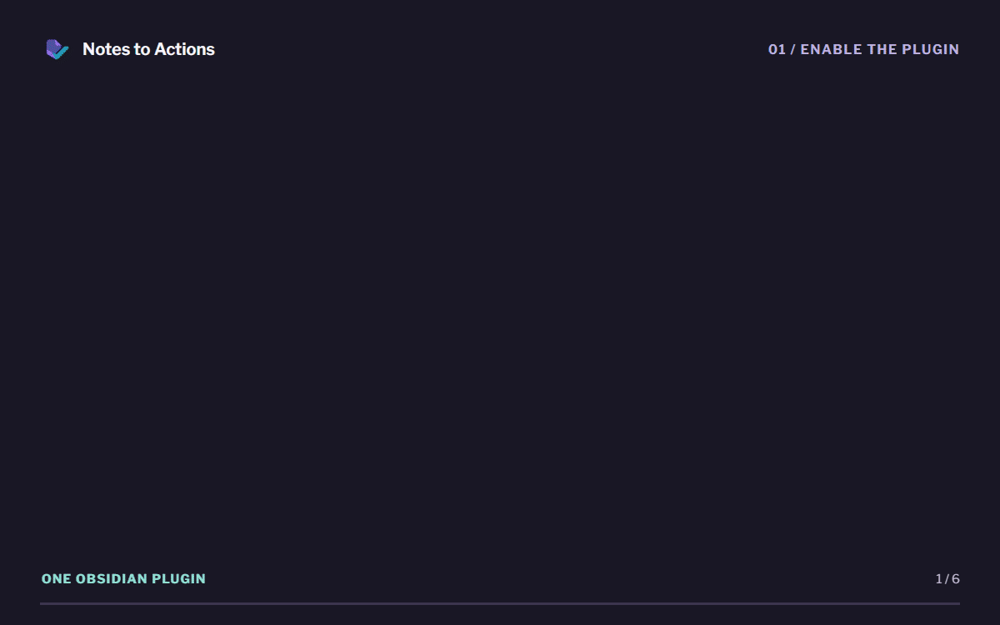
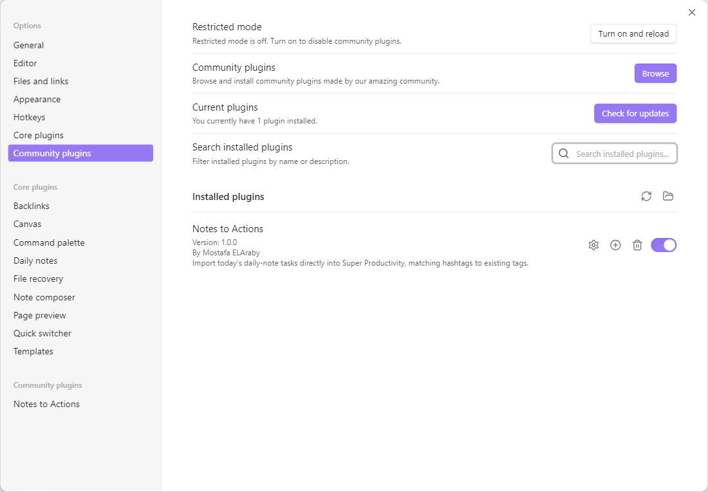
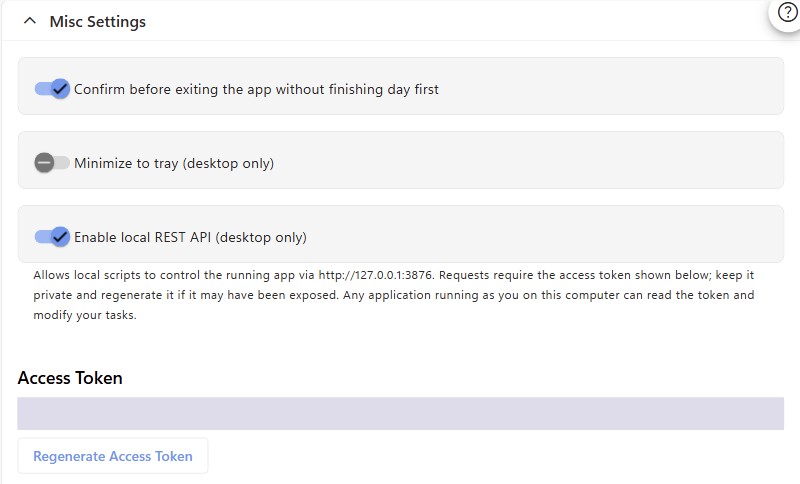
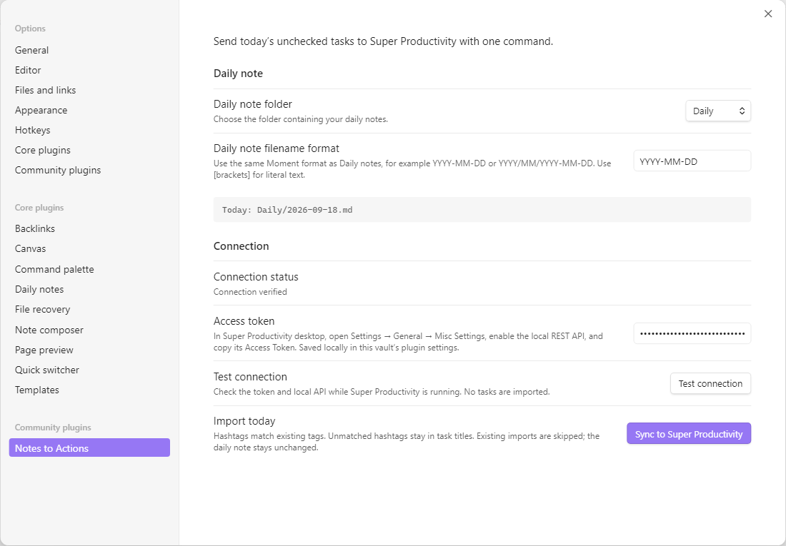
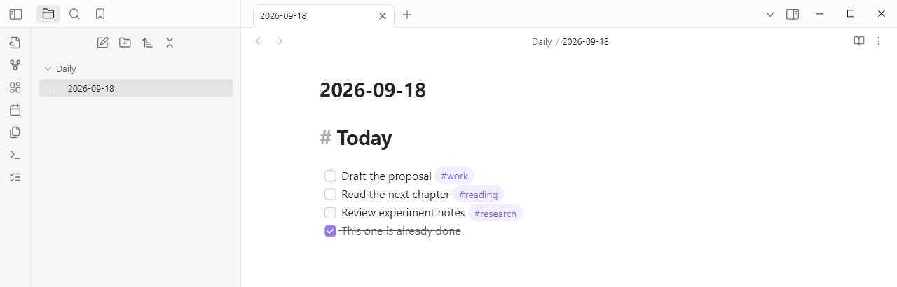
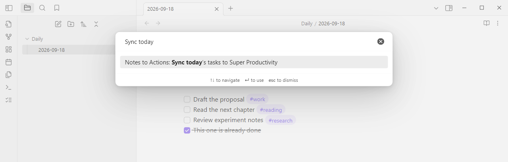
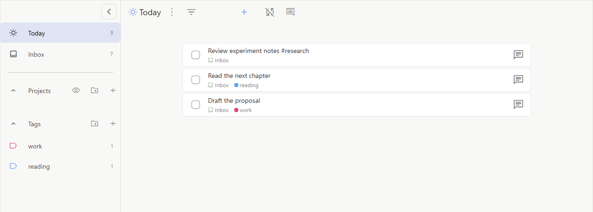

<p align="center">
  
</p>

<h1 align="center">Notes to Actions</h1>

<p align="center"><strong>Obsidian → Super Productivity</strong><br>By Mostafa ELAraby</p>

Turn today's daily note into today's task list. Write checkboxes in Obsidian, run one command, and see them in Super Productivity's **Today** view.

**One Obsidian plugin.** Connect directly to Super Productivity's built-in local REST API. No companion plugin or pairing step is needed.



_See how it works in 37 seconds._

```markdown
- [ ] Draft the proposal #work
- [ ] Read the next chapter #reading
- [ ] Review experiment notes #research
- [x] This one is already done
```

The first three items become tasks in the Inbox project, scheduled for today. Hashtags match **existing** Super Productivity tags, ignoring case. Unmatched hashtags are kept at the end of the task title as text; the plugin never creates tags. Each imported task includes a link back to its daily note.

## Features

- Choose your daily-note folder and filename format, including year/month subfolders.
- Import on demand from the command palette, ribbon, or settings.
- Read unchecked `- [ ]` items, including nested lists and callouts.
- Reuse existing tags without requiring tags for a successful import.
- Skip previously imported tasks, including completed and archived tasks.
- Resume interrupted imports using markers stored in task notes.
- Keep your daily note unchanged. No background task sync or checkbox writeback.

## Requirements

- **Obsidian desktop 1.7.7 or newer.**
- **Super Productivity desktop 19.0.1 or newer**, running on the same computer.
- Super Productivity's **local REST API enabled**, with its access token entered in the plugin settings.

The local REST API is available in the Electron desktop app. The web and mobile versions cannot serve this connection. See the [official REST API documentation](https://github.com/super-productivity/super-productivity/blob/v19.0.1/docs/wiki/3.01-API.md#3-local-rest-api).

## Step-by-step installation

Install the Obsidian ZIP, enable Super Productivity's local API, then paste its token into the Obsidian plugin. The screenshots below show **Obsidian 1.7.7** and **Super Productivity 19.0.1** on Windows using a disposable demo vault and task profile. The same setup was used to verify a real desktop import.

### 1. Get the Obsidian plugin

Download **`obsidian-super-productivity.zip`** from this repository's **Releases** section when a release is available.

If no release is published, [build from source](#development). Run `npm ci`, then `npm run package`; the installable ZIP will be in `dist/`. GitHub's **Source code (zip)** download must be built first.

### 2. Install and enable it in Obsidian

1. Find your vault folder on disk. Right-click a note in Obsidian's file explorer and choose **Show in system explorer** (wording varies by OS).
2. Open the vault's `.obsidian/plugins/` folder. Create `plugins` if needed. If your vault uses a custom configuration folder, use that instead of `.obsidian`.
3. Extract the ZIP here, keeping its included `super-productivity` folder. Check that the files are directly inside it:

   ```text
   Your vault/
   └── .obsidian/
       └── plugins/
           └── super-productivity/
               ├── main.js
               ├── manifest.json
               ├── styles.css
               └── LICENSE
   ```

4. Restart Obsidian and open the same vault.
5. Open **Settings → Community plugins**. Turn on community plugins if Restricted mode is enabled.
6. Enable **Notes to Actions** by **Mostafa ELAraby**.



_The switch beside the plugin should be on. Its settings entry then appears in the left sidebar._

If `.obsidian` is hidden, enable **View → Show → Hidden items** in Windows File Explorer, or press **Cmd + Shift + .** in macOS Finder. Avoid an extra nested folder when extracting the ZIP.

This is a manual installation; the plugin is not yet listed in Obsidian's community catalog.

### 3. Enable Super Productivity's API

1. Open **Super Productivity desktop → Settings → General**.
2. Expand **Misc Settings** and turn on **Enable local REST API (desktop only)**.
3. Select and copy the **Access Token** displayed below the switch.
4. Keep Super Productivity running.



_The token is concealed in this screenshot. Copy your own token from the app; you do not need to regenerate it during normal setup._

There is nothing to install in Super Productivity.

### 4. Configure the Obsidian plugin

1. Open **Obsidian → Settings → Notes to Actions**.
2. Choose your **Daily note folder**, for example `Daily`. Create the folder first and reopen settings if it is missing from the dropdown. For notes in the vault root, select **Vault root**.
3. Enter your **Daily note filename format**, for example `YYYY-MM-DD` without `.md`.
4. Confirm the **Today:** preview matches the actual note path.
5. Paste the copied token into **Access token**. Settings save automatically.
6. Click **Test connection**. You should see **Connection verified**.



_Use your own note folder and format. The Today preview changes with the local date; the screenshot uses September 18, 2026._

The connection test reads API status without importing anything. Status describes the most recent check or import; the plugin does not continuously monitor the other app.

### 5. Import your first tasks

1. Open or create today's note at the path shown in settings.
2. Add unchecked items like the example at the start of this guide. Tags are optional. To reproduce the screenshots exactly, first create tags named `work` and `reading` in Super Productivity: hover over **Tags** in its sidebar, click **+**, enter the name, and save. Leave `research` absent to see how unmatched hashtags behave.



3. Open Obsidian's command palette with **Ctrl + P** on Windows/Linux or **Cmd + P** on macOS.
4. Type **Sync today**, select **Notes to Actions: Sync today’s tasks to Super Productivity**, and press **Enter**. You can also click **Sync to Super Productivity** in plugin settings or use the checklist ribbon icon.



5. Read the import notification and open **Today** in Super Productivity. With the sample above, the first import reports **Imported 3; already imported 0**.



_The checked item is absent. Existing `work` and `reading` tags are attached; `#research` remains in the title because that tag does not exist._

6. Run the command again. The same sample should report **Imported 0; already imported 3**, with no duplicate tasks.

For a hashtag such as `#work` to become a tag, create a tag named `work` in Super Productivity before importing. Without that tag, the task still imports and keeps `#work` as title text.

See [screenshot details](docs/screenshots/README.md) for capture versions, redaction, and sample data.

### Updating from the earlier companion version

Replace the Obsidian plugin files and restart Obsidian. You can disable and remove the old **Obsidian to Super Productivity** companion from **Super Productivity → Settings → Plugins**. Enable the local REST API and enter its token using steps 3–4 above.

Your daily-note settings and vault identity are preserved. Keep the existing `data.json` and the source markers in imported tasks so duplicate detection continues to work. Old pairing codes are not REST access tokens and are no longer used.

The current display name is **Notes to Actions**, with the same `super-productivity` plugin ID. If you assigned a hotkey in an earlier development build, reassign it to the current sync command.

## Daily use and behavior

Add tasks to today's daily note, keep Super Productivity desktop open, and run the sync command. Assign a hotkey under **Obsidian → Settings → Hotkeys** if desired.

The plugin reads today's note even when another note is active. If today's note is open in the editor, it reads the current editor content. Missing notes produce an error and are never created automatically.

### Daily-note formats

Match your folder and Moment date format. Obsidian Daily notes and Periodic Notes are optional; this plugin stores its own settings.

| Folder     | Filename format      | Example path on September 18, 2026 |
| ---------- | -------------------- | ---------------------------------- |
| Vault root | `YYYY-MM-DD`         | `2026-09-18.md`                    |
| `Daily`    | `YYYY-MM-DD`         | `Daily/2026-09-18.md`              |
| `Journal`  | `YYYY/MM/YYYY-MM-DD` | `Journal/2026/09/2026-09-18.md`    |
| `Daily`    | `[Day] YYYY-MM-DD`   | `Daily/Day 2026-09-18.md`          |

Dates use your computer's local calendar date. Super Productivity's custom start-of-day offset can make its Today view differ around midnight.

### Checkboxes and tags

- Only hyphen checkboxes with a space inside (`- [ ]`) are imported. Checked boxes, empty titles, frontmatter, fenced code, HTML comments, and Obsidian `%%` comments are ignored.
- The checkbox line supplies the title. Continuation paragraphs are not imported. Markdown formatting and links are preserved.
- `#work` matches an existing tag named `work`, regardless of case. `#work/project-a` matches a single tag with that entire name.
- Unmatched hashtags move to the end of the task title as plain text. The import notification reports how many distinct hashtags were unmatched. Tags are never created automatically.
- Hashtags inside inline code, links, URL fragments, escaped hashtags, and numeric references such as `#123` stay literal.
- Nested checkboxes become independent tasks. Tags are not inherited from headings or parent items.

### Repeated imports

Task notes contain source markers used for duplicate detection. Keep those markers. Unchanged tasks retain their identity when you insert lines or reorder distinct items. Two identical checkbox lines count as two tasks.

Editing a title or its hashtags, moving/renaming the daily note, deleting an imported task, or removing its source marker can cause a new import. Removing one of several identical lines can shift their occurrence numbers.

This is an import workflow: existing tasks are not updated on subsequent imports. Creating a missing tag later will not automatically attach it to an already imported task; edit that task in Super Productivity if needed.

Imports stop on the first failure. Successfully imported tasks remain. Fix the reported issue, then run the command again. If creation succeeds but the final update fails, a task may briefly be named **Obsidian task**; its pending marker lets a retry finish it.

## Connection and privacy

Requests go directly to `http://127.0.0.1:3876` with the access token in an authorization header. The plugin opens no listening port, ignores proxy environment variables, and never follows redirects. It only connects during an explicit test or import.

The access token is saved unencrypted in this vault's `.obsidian/plugins/super-productivity/data.json`. Keep that file private and consider excluding it from vault sync or shared backups. If you regenerate the token in Super Productivity, paste the replacement into the plugin settings.

The plugin reads Super Productivity's tasks (including completed and archived tasks) and tags for matching. It sends imported task titles, tag IDs, dates, source markers, and backlinks containing the vault name and note path. It does not send the rest of the daily note or add telemetry. Super Productivity may sync its tasks according to your own sync configuration.

This integration requires no payment or online account. The plugin makes no requests to remote services and does not read files outside the vault.

Each vault keeps its own import identity and can use the same local API. Avoid simultaneous imports of the same synced vault from multiple app instances or computers.

## Troubleshooting

| Symptom                         | What to check                                                                                   |
| ------------------------------- | ----------------------------------------------------------------------------------------------- |
| Plugin missing in Obsidian      | Check the folder layout in step 2, restart Obsidian, and enable community plugins.              |
| Access token needed/rejected    | Enable the local REST API and copy its current Access Token into the plugin settings.           |
| Cannot reach Super Productivity | Start the desktop app and enable its local REST API. The web app cannot serve this API.         |
| Local API setting missing       | Use Super Productivity Electron desktop 19.0.1 or newer.                                        |
| Daily note not found            | Check the path preview, folder, capitalization, and filename format.                            |
| No unchecked tasks              | Use `- [ ] Task title` outside code blocks and comments.                                        |
| Hashtag remains in title        | Create that tag in Super Productivity before importing new tasks. Existing imports are skipped. |
| Import stopped/timed out        | Keep the app open, resolve the reported error, and run the command again.                       |
| Task absent from Today          | Check its scheduled date and your custom start-of-day offset.                                   |

An import accepts up to 1,000 tasks. Each API request has a 15-second deadline and a 32 MiB response limit. Large task archives may reach those limits.

## Development

Use Node.js 22 or newer and npm.

```sh
npm ci
npm run package
```

Packaging checks formatting, compiles TypeScript, builds the plugin, runs tests, and creates:

```text
dist/
├── main.js                          # Attach separately to the GitHub release
├── manifest.json                    # Attach separately to the GitHub release
├── styles.css                       # Attach separately to the GitHub release
├── LICENSE
├── obsidian-super-productivity.zip
└── super-productivity/             # Ready to copy into an Obsidian vault
```

`npm run dev` watches the Obsidian entry point and writes `main.js` at the repository root. `npm run check` runs the checks without packaging, and `npm run format` applies formatting.

| Location                             | Responsibility                                                            |
| ------------------------------------ | ------------------------------------------------------------------------- |
| `src/main.ts`, `src/settings.ts`     | Commands, note access, token settings, and status                         |
| `src/parser.ts`, `src/daily-note.ts` | Checkbox extraction, paths, and stable source identities                  |
| `src/rest-api.ts`                    | Authenticated local HTTP requests, validation, timeouts, and cancellation |
| `src/importer.ts`, `src/api.ts`      | Existing-tag matching, duplicate detection, and task import policy        |
| `src/import-types.ts`                | Import data validation and source markers                                 |
| `tests/`                             | Parser, importer, host, bundle, and real HTTP transport tests             |

See [API notes](docs/api.md), [verification and desktop checks](docs/verification.md), and [contribution guidance](CONTRIBUTING.md). The automated HTTP tests use a local test server; they do not contact your running Super Productivity instance.

For publishing, follow the [community submission checklist](docs/submission.md). Obsidian needs the individual release assets as well as the root manifest; a ZIP alone is insufficient. Pushing a version tag runs the release workflow and prepares a draft for review.

## Author and license

Created by **Mostafa ELAraby**. Released under the [MIT License](LICENSE).

If Notes to Actions helps your workflow, you can [buy me a coffee](https://buymeacoffee.com/mostafaelaraby) to support its development. Donations are optional; all features remain free.

Logo assets and the generation prompt are in [assets/](assets/README.md). This is an independent integration, not an official Obsidian or Super Productivity product.
